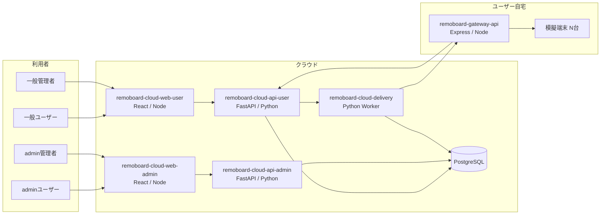

# システム全体図

- クラウド内は Web / API / 配信ワーカー / DB で責務を分離する
- 配信は `remoboard-cloud-api-user` から `remoboard-cloud-delivery` へジョブ連携し、ゲートウェイ経由で端末へ反映する
- ゲートウェイはクラウドへのコールバック（配信結果通知など）として `remoboard-cloud-api-user` を呼び出す
